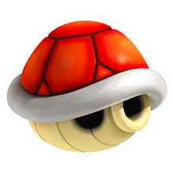
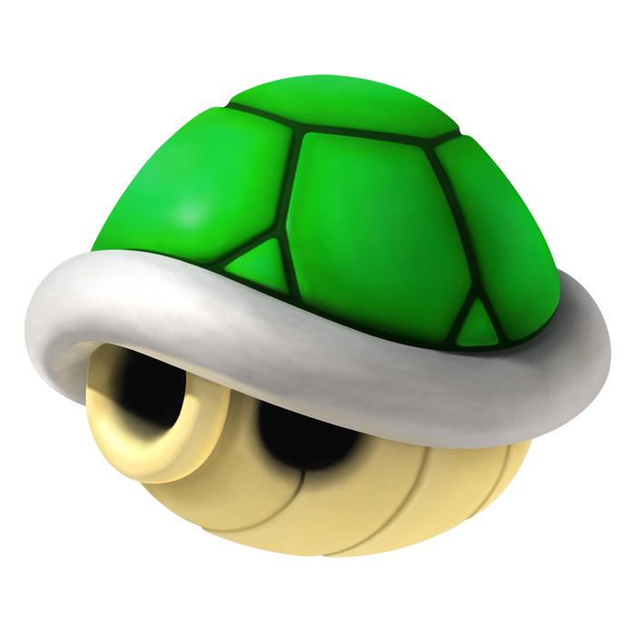
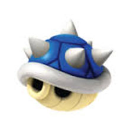
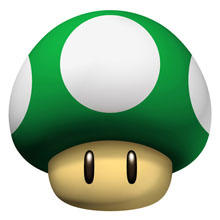
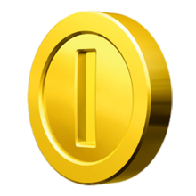
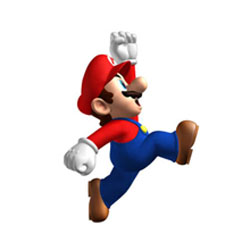
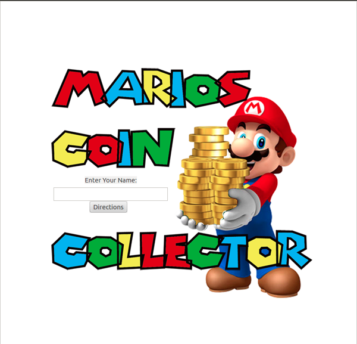
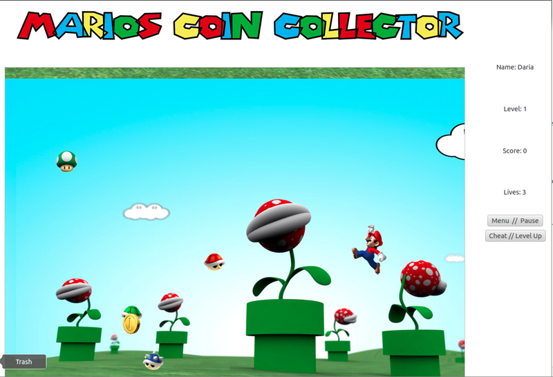

# Game Design Document
Author: Daria Caraway

----

## Mario's Coin Collector

### Goal

As Mario, the player's goal is to collect coins. Easy Right? However, there will be different monsters, the shells, that are trying to stop you. 

### Part 1 (What are my "things"?)
  1. Red "Tracker" Shell 
    * Moving: This "thing" will follow around the user (Mario) as he tries to reach the coin.
    * Functions: Has the capability to take away a life.
    
  2. Green "Random" Shell
    * Moving: This "thing" will randomly move move around the screen bouncing off the sides.
    * Functions: Has the capability to take away a life. 
  
  3. Blue "Spiked" Shell
  	* Moving: This "thing" will guard the coin, tracing a rectangular path around it.
  	* Functions: Has the ability to kill the player on impact.
  
  4. Green "1 Up" Mushroom
    * Moving: This "thing" wont move, but will appear after a certain interval through the game.
    * Function: Has the ability to give the player an extra life.
    
  5. The Coin
    * Moving: This "thing" will bounce up and down in place waiting to be retrieved by the player.  Once the coin has been collected it will then randomly pop up in a new location for the player to collect again.
    * Function: Has the ability to send the user to another level.
    
#### Photos:

Red Shell

Green Shell 

 

Blue Shell 

Green Mushroom

Coin

Mario! He will be transformed to match the different directions.

    
### Part 2 (How to play? and How it works)
The game will be played by controlling Mario with the arrow keys. He can only move in the four given
directions, and cannot move diagnoally.  To retrieve the coin the player must direct Mario to collide with the bouncing coin.  After the player gets 3 coins he will level up.  Each level
will have more and more shells that move faster and faster.

### Part 3 (The Score!!)
The player will earn points everytime Mario retirves a coin or when he reaches a new level, and as the levels get harder the coins will be worth more points.

### Part 4 (Lives)
The player will begin with three lives, every time he gets hit by a shell his lives will decrease by one, and the player  will a) be reincarnated in the corner of the screen if there are more lives available or the game will be over. If the green mushroom appears and Mario gets ahold of it, he will get an extra life added to his stock pile.
 
### Part 5 (The interface)
When the game begins, the user will be able to type his or her name and press the start button.
Once the player is in the game, there will be a menu/pause button on the top of the screen, and when pressed, will pause the game,
and give two options, to restart the game completeley or quit and terminate the application.  There is also a cheat button that allow the grader to go to the next level.  This
shouldn't be used for fun, but just to demonstrate the differences between the levels for grading. There will be four other pieces of data on the screen,
the score, the current level, and the amount of lives the player has remaining.

Note: the background is a classical mario scene with the Pirahnna plants!

This is a screen shot of the welcome screen, the push button takes the player to a page with basic insctructions and notes.

This is a screen shot of the game being played! I hope you enjoy!!!!!

 

