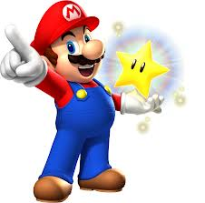

# Game Design Document
Author: Daria Caraway

----

## Mario's Coin Collector

### Goal

As Mario, the player's goal is to collect coins. Easy Right? However, there will be different monsters, the shells, that are trying to stop you. 

### Part 1 (What are my "things"?)
  1. Red "Tracker" Shell
    * Moving: This "thing" will follow around the user (Mario) as he tries to reach the coin.
    * Functions: Has the capability to take away a life.
    
  2. Green "Random" Shell
    * Moving: This "thing" will randomly move move around the screen bouncing off the sides.
    * Functions: Has the capability to take away a life. 
    
  3. Blue "Spiked" Shell
  	* Moving: This "thing" whill guard the coin, tracing a rectangular path around it.
  	* Functions: Has the ability to kill the player.
  
  4. Green "1 Up" Mushroom
    * Moving: This "thing" wont move, but will appear at random intervals through the game play and will blink and 
    * Function: Has the ability to give the player an extra life.
    
  5. The Coin
    * Moving: This "thing" will bounce up and down in place waiting to be retrieved by the player.  Once the coin has been collected it will then randomly pop up in a new location for the player to collect again.
    * Function: Has the ability to send the user to another level.
    
#### Photos:

Red Shell

Green Shell 
 

Blue Shell 

Green Mushroom

Coin

Mario! He will be transformed to match the different directions.

Mario when you get a star! (Explained Later)

    
### Part 2 (How to play? and How it works)
The game will be played by controlling Mario with the arrow keys. He can only move in the four given
directions, and cannot move diagnoally.  To retrieve the coin the player must direct Mario to collide with the bouncing coin.  After the player gets 3 coins they will level up.  Each level
will have more and ore shells that move faster and faster.

### Part 3 (The Score!!)
The player will earn points everytime Mario retirves a coin, and as the levels get harder the coins will be worth more points.  Also, every twelve coins the coins will be traded in for a star and the star will be worth bonus points.

### Part 4 (Lives)
The player will begin with three lives, every time he gets hit by a shell his health meter will decrase in half, after
the health meter is decremented twice, the player will die and will a) be reincarnated in the corner of the screen if there are more lives available
or b) the game will be over. If the green mushroom appears and Mario gets ahold of it, he will get an extra life added to his stock pile.
 
### Part 5 (The layout)
I apologize I am not an artists, I am a computer science major...

 

